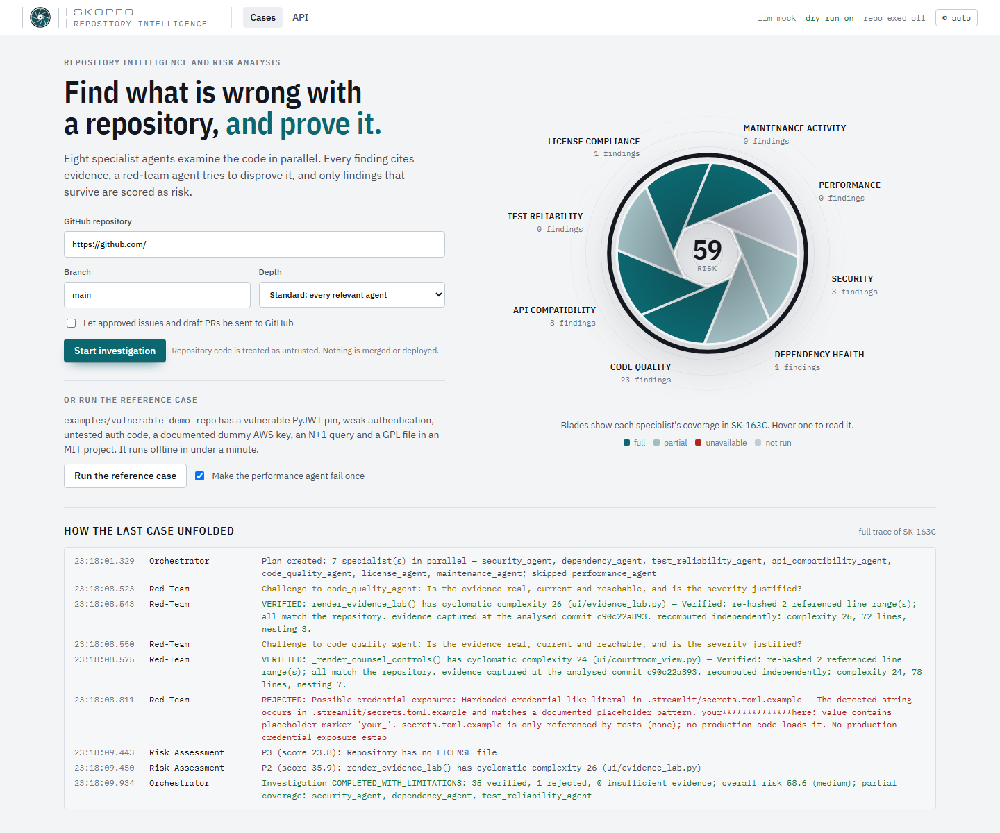
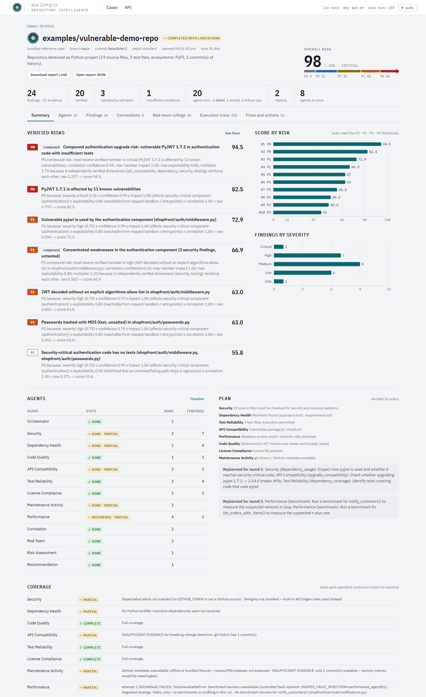
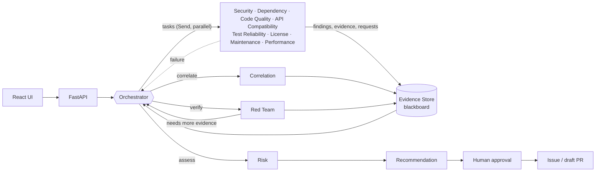
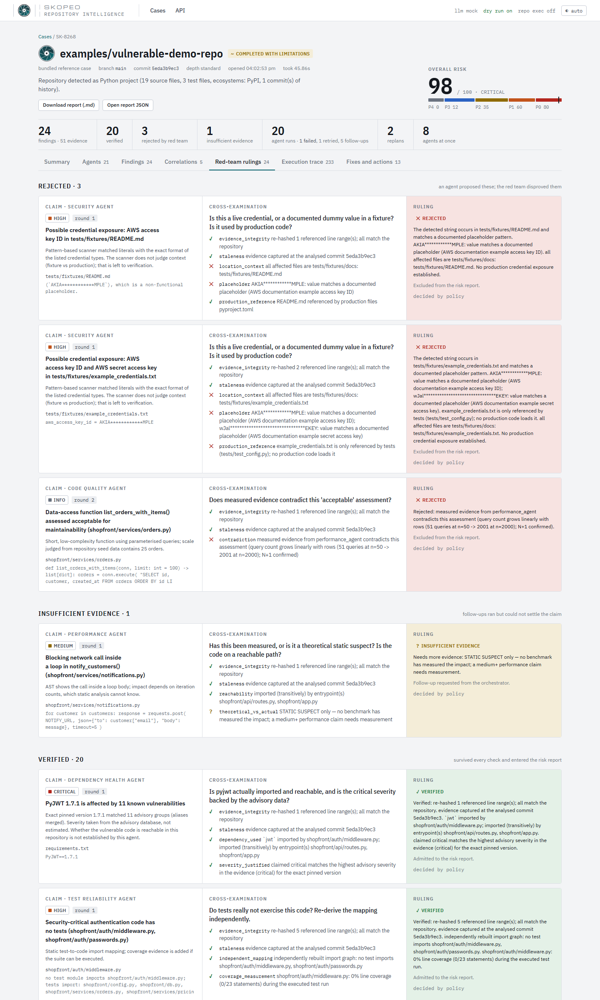
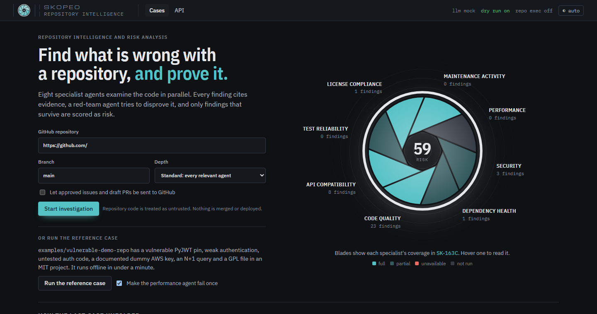
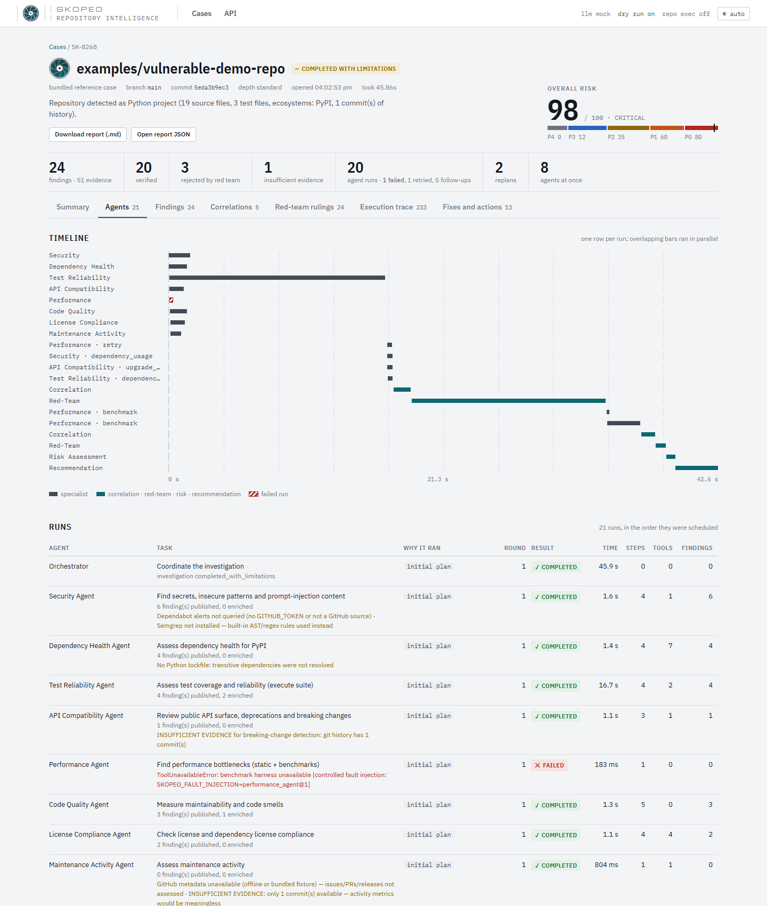
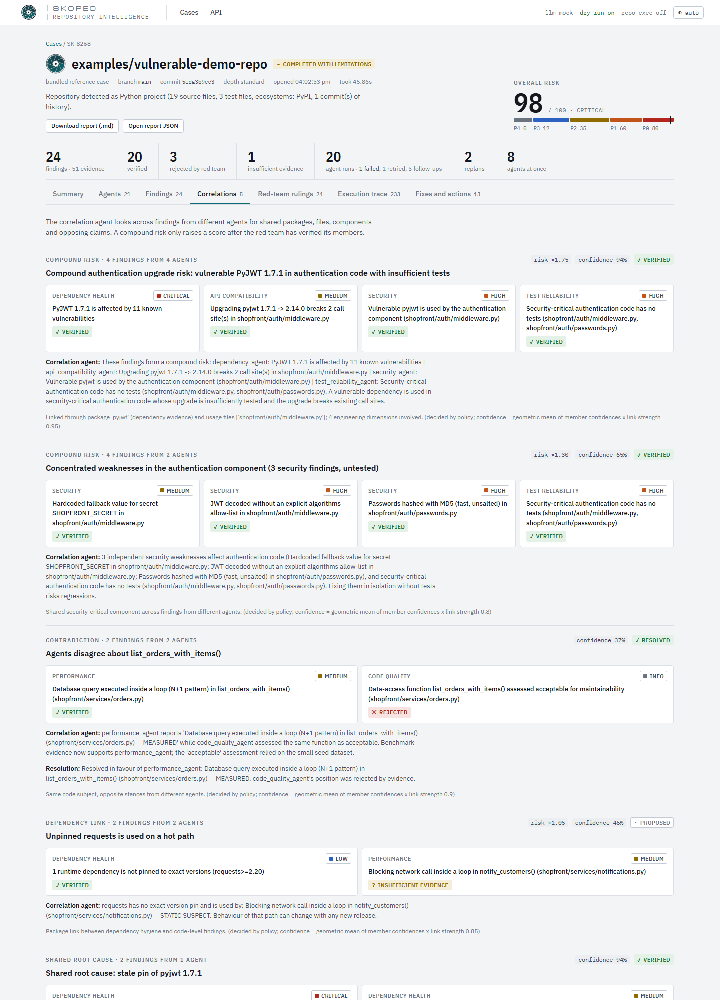
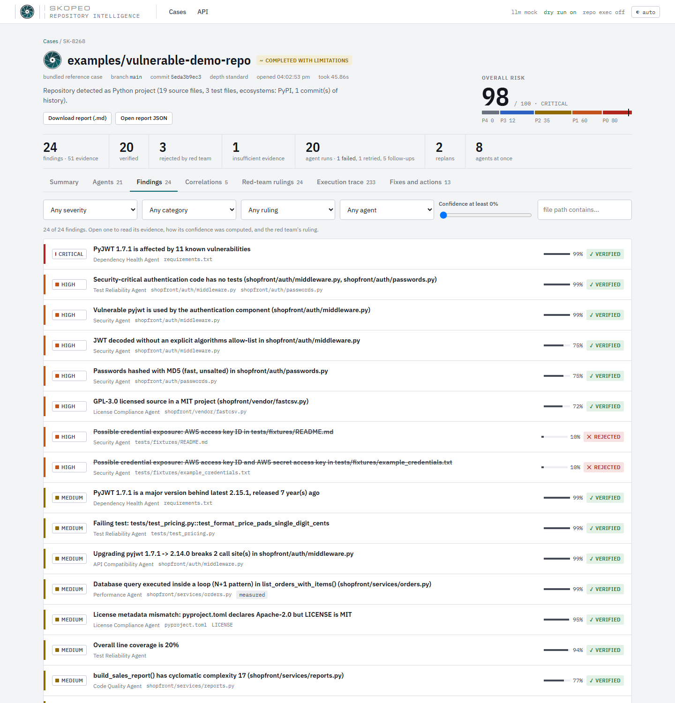
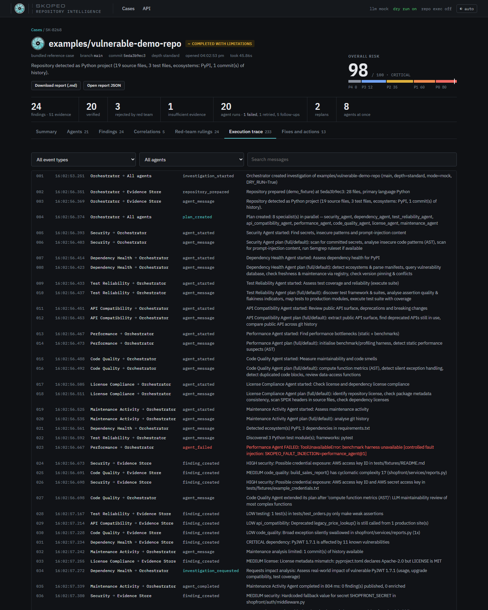
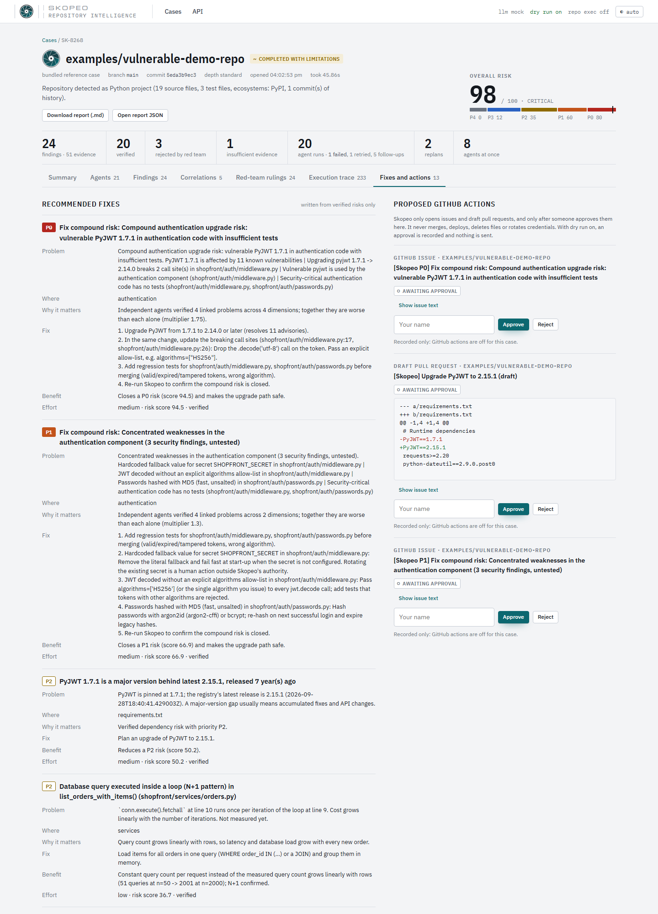

<p align="center"></p>

# Skopeo

**Multi-agent repository intelligence and risk analysis.** Skopeo investigates a software
repository with a team of specialist agents, links their evidence into compound risks, has a
red-team agent try to disprove every finding, and scores only what survives.



The mark is an iris aperture with eight blades, one per specialist agent, converging on a single point of focus. On the landing page the blades are coloured by each agent's coverage in the latest case and the opening shows its risk score; while agents work, the iris turns and breathes.



---

## 1. Problem

Scanners tell you a dependency is vulnerable, a linter tells you a function is complex, coverage
tells you a file is untested. Nobody tells you that the vulnerable library sits in your login path,
that upgrading it breaks two call sites, and that nothing tests that code. Meanwhile half the
alerts are noise: an "exposed AWS key" that is the documented example value in a test fixture.

## 2. Solution

Skopeo runs an investigation the way a small engineering team would:

1. an **orchestrator** reads the repository and decides who should look at what;
2. **eight specialists** investigate in parallel and post evidence to a shared **Evidence Store**;
3. when evidence raises new questions, agents **ask for follow-ups** and the orchestrator **re-plans**;
4. a **correlation agent** connects findings across specialists;
5. a **red-team agent** challenges every finding with its own checks and **rejects** what does not hold;
6. a **risk agent** scores only verified findings, and a **recommendation agent** writes the fixes;
7. anything that would touch GitHub waits for **human approval** (and `DRY_RUN` is on by default).

## 3. Why multiple agents, and why this is not a workflow

No single agent has all the evidence or expertise. Skopeo uses independent specialist
investigations, cross-agent correlation and an adversarial verification stage, and the final risk
assessment only trusts findings that survive verification.

It is not `A → B → C → summary`:

| A fixed pipeline would… | Skopeo… |
| --- | --- |
| run every step in order | lets the orchestrator choose each next phase after reading the blackboard (`dispatch`, `correlate`, `verify`, `assess`) |
| run the same tasks for every repository | plans per repository profile and records why each agent was selected or skipped |
| ignore what earlier steps found | schedules follow-ups from findings and from agents' own requests — a vulnerable auth library adds three new tasks; an unmeasured performance claim adds a benchmark |
| stop on the first error | isolates failures, retries with a degraded strategy, and reports partial coverage |
| trust every step's output | has a red team that rejects findings and sends work back for more evidence |
| summarise at the end | reasons across findings to create compound risks and to resolve disagreements between agents |

All of this is visible, step by step, in the persisted [execution trace](docs/execution-trace.md).

## 4. Architecture



Full diagrams (every agent and path, the LangGraph state machine, the data model):
[docs/architecture.md](docs/architecture.md).

## 5. Agents

| Agent | Looks at | Key tools |
| --- | --- | --- |
| Orchestrator | the whole investigation | repository profile, blackboard state, budgets |
| Security | secrets, unsafe calls, prompt-injection text, use of vulnerable packages | secret patterns, Python AST, import graph, Semgrep*, Dependabot* |
| Dependency Health | vulnerabilities, freshness, pinning, conflicts (PyPI, npm, Go, crates.io, Maven) | manifest parsers, OSV.dev, PyPI/npm registries |
| Code Quality | complexity, nesting, swallowed exceptions, duplication | AST metrics; LLM only for a short review narrative |
| API Compatibility | public API, deprecations in use, breaking changes, upgrade compatibility | AST, git history, curated migration rules with changelog links |
| Test Reliability | weak tests, untested critical code, real test failures | pytest + coverage.py (when allowed), AST |
| License Compliance | license file vs metadata, copyleft files, dependency licenses | text fingerprints, SPDX headers, registry metadata |
| Maintenance Activity | commit cadence, bus factor, stale modules, releases, PRs | git log, GitHub REST* |
| Performance | N+1 queries, network calls in loops — static suspect vs measured | AST, benchmark runner |
| Correlation | relationships across all findings | typed link graph + LLM/policy assessment |
| Verification / Red Team | whether each finding is real, reachable, justified, reproducible | re-hashing, import graph, test re-runs, recomputation |
| Risk Assessment | priority of verified findings and compound risks | transparent formula |
| Recommendation | fixes, issues, draft PRs | templates + LLM wording |

\* optional, when installed / when a token is configured. Specifications:
[docs/agent-specifications.md](docs/agent-specifications.md).

## 6. Evidence Store (blackboard)

A relational store (SQLite via SQLAlchemy, Alembic migrations, PostgreSQL-ready) holding
investigations, agent runs, findings, evidence, investigation requests, correlations,
verifications, risks, recommendations, action proposals and execution events. Agents never pass
results to each other directly; they write to the store and read from it. A finding without
evidence is refused unless it is explicitly a hypothesis. Confidence is **computed from the
evidence** (source weights, reproduction, reachability, corroboration, contradictions,
verification) and every factor is stored and shown.

## 7. Correlation

The correlation agent builds a graph of typed links between findings — same package, file,
component or code subject, or opposite stances — and evaluates candidate relationships:
**compound risk**, **shared root cause**, **causal chain**, **dependency link**, **duplicate**,
**contradiction**. Example from the reference case:

> Dependency: *PyJWT 1.7.1 is affected by 11 known vulnerabilities* · API: *upgrading to 2.14.0 breaks
> 2 call sites* · Security: *vulnerable pyjwt is used by the authentication component* · Tests:
> *security-critical authentication code has no tests* → **Compound authentication upgrade risk**, ×1.75.

## 8. Verification

The red team asks each finding: is the evidence real, current and reachable; is the dependency used;
is the severity justified; is it a placeholder or fixture; does configuration mitigate it; can it be
reproduced; is this theoretical or measured. It answers with its own tools and rules **verified**,
**rejected** or **needs more evidence** (which becomes a follow-up request).



## 9. Fault isolation

Each agent runs behind a fault boundary: an exception, timeout or budget overrun marks only that
run as failed, keeps its evidence, and notifies the orchestrator, which retries with a fallback
strategy or reports the capability as unavailable. The case finishes `completed_with_limitations`
with a coverage table that says exactly what could not be examined.

## 10. Adaptive replanning

The orchestrator reviews the blackboard after every phase. Triggers in the current
implementation: failed runs (retry, degraded strategy), investigation requests from any agent
(impact analysis, usage analysis, upgrade compatibility, test coverage, benchmarks), high-impact
vulnerable dependencies (proactive escalation), new evidence (re-correlate), unchallenged findings
(verify), budgets and deadlines (assess early), cancellation.

## 11. Security model

Repository content is data, never instructions: one-way prompt boundary, delimiter neutralisation,
schema-validated LLM output and allowlisted decisions. No shell; every subprocess is an argv list
checked against an allowlist, with timeouts, output caps and resource limits. Hardened shallow
clones, path-traversal protection, scrubbed child environments, redaction everywhere, untrusted
repository code is not executed unless sandboxed execution is enabled, and nothing reaches GitHub
without approval. Details: [docs/security.md](docs/security.md).

## 12. Tech stack

Python 3.12 · FastAPI · LangGraph · Pydantic 2 · SQLAlchemy 2 + Alembic (SQLite) · httpx ·
coverage.py / pytest · React 19 + TypeScript + Vite · Recharts · Docker Compose.

## 13. Setup

Requirements: Python 3.12+, Node 20+, git. Docker is optional.

```bash
cd backend
python -m venv .venv
.venv/bin/pip install -r requirements-dev.txt        # Windows: .venv\Scripts\pip ...
cd ../frontend
npm install
```

## 14. Environment variables

Copy `.env.example` to `.env`. The defaults run everything offline-capable in mock mode.

| Variable | Default | Purpose |
| --- | --- | --- |
| `SKOPEO_MODE` | `mock` | `mock` (deterministic policies) or `live` (LLM decisions) |
| `LLM_PROVIDER` / `OPENAI_API_KEY` / `LLM_BASE_URL` | `openai` / — / OpenAI | provider for live mode; any OpenAI-compatible server works |
| `LLM_MODEL_REASONING` / `LLM_MODEL_FAST` | `gpt-4o` / `gpt-4o-mini` | model by task type |
| `SKOPEO_DEMO_MODE` | `true` | enables the reference case |
| `SKOPEO_OFFLINE` | `false` | no network; bundled advisory snapshot only |
| `DRY_RUN` | `true` | approvals are recorded, never sent |
| `GITHUB_TOKEN` | — | optional; Dependabot, higher rate limits, approved actions |
| `SKOPEO_SANDBOX_EXECUTION` | `false` | allow running tests/benchmarks of cloned repositories |
| `SKOPEO_FAULT_INJECTION` | — | controlled failures, e.g. `license_agent@*` |
| `AGENT_MAX_ITERATIONS`, `AGENT_MAX_TOOL_CALLS`, `AGENT_TIMEOUT_SECONDS`, `AGENT_MAX_RETRIES`, `INVESTIGATION_TIMEOUT_SECONDS` | 40, 400, 180, 1, 1200 | loop and cost limits |

The full list with comments is in [.env.example](.env.example).

## 15. Running locally

```bash
cd backend && .venv/bin/python -m uvicorn app.main:app --port 8000
```

```bash
cd frontend && npm run dev
```

Open http://localhost:5173. The API applies its migrations on start. With Docker:

```bash
docker compose up --build
```

UI on http://localhost:8080, API on http://localhost:8000.

## 16. Running the demo

Click **Run the reference case** on the landing page, or from the command line:

```bash
cd backend && .venv/bin/python scripts/run_demo.py --markdown report.md
```

The walkthrough is in [docs/demo-scenario.md](docs/demo-scenario.md).

## 17. Running tests

```bash
cd backend && .venv/bin/python -m pytest
```

147 tests: unit tests for schemas, the confidence and risk models, URL/branch validation, the
command allowlist, path traversal, redaction, prompt-injection defences, manifests, advisories,
correlation and verification logic; integration tests that run the full multi-agent investigation
and assert every acceptance criterion (parallelism, replanning, correlation, rejection,
verification, retry, insufficient evidence, trace completeness, no repository modification, DRY_RUN);
an end-to-end test through the HTTP API with an untrusted repository. Lint and build:

```bash
cd backend && .venv/bin/python -m ruff check .
```

```bash
cd frontend && npm run lint && npm run build
```

## 18. API

`POST /api/investigations`, `POST /api/demo/investigations`, `GET /api/investigations/{id}` and
`/agents`, `/findings`, `/evidence`, `/correlations`, `/verifications`, `/risks`,
`/recommendations`, `/actions`, `/requests`, `/events`, `/report?format=json|markdown`,
`POST /cancel`, `POST /approve-action`, `GET /api/health`. Schemas: [docs/api.md](docs/api.md);
OpenAPI at `/docs`.

## 19. Screenshots

| | |
| --- | --- |
|  |  |
|  |  |
|  |  |

## 20. Example execution trace

From the reference case (full excerpt in [docs/execution-trace.md](docs/execution-trace.md),
full report in [docs/sample-report.md](docs/sample-report.md)):

```
10:32:56.374  orchestrator        → all_agents        plan_created            Plan created: 8 specialist(s) in parallel
10:32:56.667  performance_agent   → orchestrator      agent_failed            ToolUnavailableError: benchmark harness unavailable [controlled fault injection]
10:32:57.272  dependency_agent    → orchestrator      investigation_requested Assess real-world impact of vulnerable PyJWT 1.7.1
10:33:13.197  orchestrator        → performance_agent agent_retry_scheduled   FAILED -> RETRYING (attempt 2, strategy 'static_only')
10:33:13.278  orchestrator        → all_agents        replan                  +security_agent (dependency_usage), +api_compatibility_agent (upgrade_compatibility), +test_reliability_agent (dependency_coverage)
10:33:14.628  correlation_agent   → blackboard        correlation_created     Compound authentication upgrade risk: vulnerable PyJWT 1.7.1 in authentication code with insufficient tests
10:33:15.905  verification_agent  → security_agent    finding_rejected        Possible credential exposure … matches a documented placeholder … No production credential exposure established.
10:33:27.228  verification_agent  → blackboard        tool_executed           python -m pytest tests/test_pricing.py::test_format_price_pads_single_digit_cents
10:33:28.020  verification_agent  → orchestrator      investigation_requested Run a benchmark for list_orders_with_items()
10:33:32.961  performance_agent   → blackboard        evidence_added          query count grows linearly with rows (51 queries at n=50 -> 2001 at n=2000); N+1 confirmed
10:33:34.579  verification_agent  → code_quality_agent finding_rejected       'acceptable' assessment contradicted by measured evidence
10:33:35.631  risk_agent          → recommendation_agent risk_assessed        P0 (score 94.5) compound: Compound authentication upgrade risk
10:33:39.167  orchestrator        → human             investigation_completed COMPLETED_WITH_LIMITATIONS: 20 verified, 3 rejected, 1 insufficient evidence
```

## 21. Limitations

* AST-level analysis is Python-first; other languages get manifest, advisory, license and regex coverage.
* Tests and benchmarks of real repositories run only with sandboxed execution enabled and installable dependencies.
* Reachability is import-graph based; dynamic loading is reported as inconclusive.
* No transitive resolution for Python without a lockfile.
* In mock mode decisions come from transparent rules, not a model.
* The API has no authentication of its own.

More in [docs/design-document.md](docs/design-document.md#18-limitations).

## 22. Future work

* Language servers / tree-sitter for JS, Go and Java data flow; execution of their test suites in the sandbox.
* Profiling (py-spy) and `pytest-benchmark` result ingestion for performance measurement.
* SARIF import so existing scanners can feed the blackboard as evidence sources.
* Incremental re-investigation on new commits, diffing findings between cases.
* Server-sent events instead of polling; authentication and multi-tenant isolation.
* PostgreSQL + a job queue for horizontal scaling.

## Repository layout

```
backend/   app/{agents,graph,llm,models,schemas,security,services,tools,api,database,config,observability,data}
           migrations/  scripts/  tests/{unit,integration,e2e}
frontend/  src/{components,pages,hooks,services,types,lib}
examples/vulnerable-demo-repo/   the reference case
docs/      architecture, design document, agent specs, security, trace, demo, API, screenshots
```
