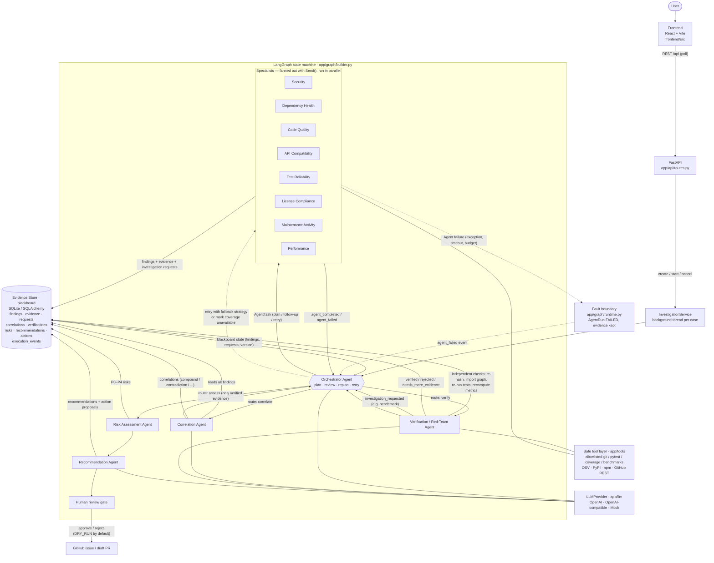
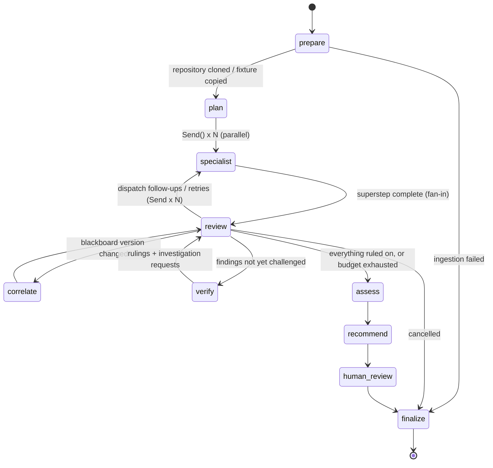
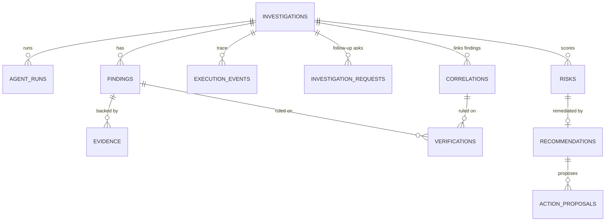

# Architecture

Skopeo is an orchestrator–worker system built on a shared blackboard (the Evidence Store).
Every arrow below is a real code path; the names match modules under `backend/app/`.

## System and data flow

Notes on the diagram:

* **Specialists never call each other.** They communicate only through the blackboard (findings,
  evidence, investigation requests) and through events the orchestrator reads.
* **The orchestrator decides every route** out of `review`; there is no unconditional edge from
  the specialists to correlation or from correlation to risk.
* **Failure path (dotted):** any exception inside an agent is caught at the fault boundary, the
  run is marked `FAILED`/`TIMEOUT`, its evidence stays on the blackboard, and the orchestrator
  decides to retry (possibly with a degraded strategy) or to report partial coverage.

## LangGraph state machine

The graph state (`app/graph/state.py`) carries only control information: the task queue, round
counters, which results were reviewed, and the blackboard version at the last correlation and
verification. All knowledge lives in the database.

## Evidence Store (blackboard) data model

Tables are created by Alembic (`backend/migrations/versions/0001_initial_schema.py`) with UUID
primary keys and indexes on `investigation_id`, `agent`, `severity`, `status` and `created_at`.
Only portable column types are used, so `DATABASE_URL` can point at PostgreSQL.

## Concurrency model

* Each investigation runs in its own thread with its own asyncio loop (`InvestigationService`).
* Specialists in the same superstep run concurrently: each agent body executes in a worker thread
  (`asyncio.to_thread`) under `asyncio.wait_for(AGENT_TIMEOUT_SECONDS)`.
* SQLite allows one writer, so every blackboard write goes through one lock
  (`app/database/session.py`); reads stay concurrent (WAL mode).
* The demo run reaches 8 agents executing at the same time (`execution_summary.parallelism`).
